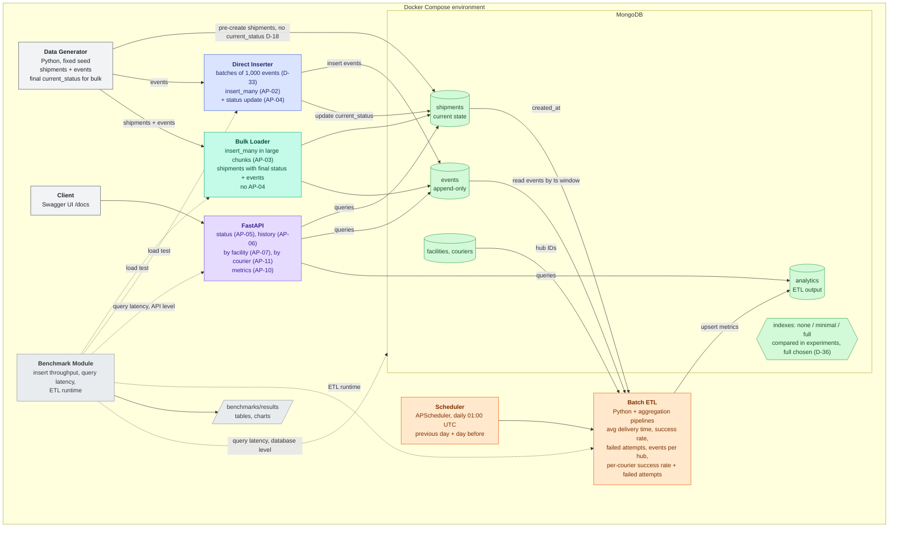

## System diagram
 

```mermaid
flowchart LR
  subgraph DC["Docker Compose environment"]
    direction LR
 
    GEN["<b>Data Generator</b><br/>Python, fixed seed<br/>shipments + events<br/>final current_status for bulk"]
 
    DIRECT["<b>Direct Inserter</b><br/>batches of 1,000 events (D-33)<br/>insert_many (AP-02)<br/>+ status update (AP-04)"]
 
    BULK["<b>Bulk Loader</b><br/>insert_many in large chunks (AP-03)<br/>shipments with final status + events<br/>no AP-04"]
 
    subgraph MONGO["MongoDB"]
      direction TB
      SH[("shipments<br/>current state")]
      EV[("events<br/>append-only")]
      REF[("facilities, couriers")]
      AN[("analytics<br/>ETL output")]
      IDX{{"indexes: none / minimal / full<br/>compared in experiments, full chosen (D-36)"}}
    end
 
    CLIENT["<b>Client</b><br/>Swagger UI /docs"]
    API["<b>FastAPI</b><br/>status (AP-05), history (AP-06)<br/>by facility (AP-07), by courier (AP-11)<br/>metrics (AP-10)"]
 
    SCHED["<b>Scheduler</b><br/>APScheduler, daily 01:00 UTC<br/>previous day + day before"]
    ETL["<b>Batch ETL</b><br/>Python + aggregation pipelines<br/>avg delivery time, success rate,<br/>failed attempts, events per hub,<br/>per-courier success rate + failed attempts"]
 
    BENCH["<b>Benchmark Module</b><br/>insert throughput, query latency,<br/>ETL runtime"]
    RES[/"benchmarks/results<br/>tables, charts"/]
  end
 
  %% Direct insert path
  GEN -->|pre-create shipments, no current_status D-18| SH
  GEN -->|events| DIRECT
  DIRECT -->|insert events| EV
  DIRECT -->|update current_status| SH
 
  %% Bulk path
  GEN -->|shipments + events| BULK
  BULK --> SH
  BULK --> EV
 
  %% Read / API path
  CLIENT --> API
  API -->|queries| SH
  API -->|queries| EV
  API -->|queries| AN
 
  %% Batch ETL path
  SCHED --> ETL
  EV -->|read events by ts window| ETL
  SH -->|created_at| ETL
  REF -->|hub IDs| ETL
  ETL -->|upsert metrics| AN
 
  %% Monitoring / benchmarking
  BENCH -.->|load test| BULK
  BENCH -.->|load test| DIRECT
  BENCH -.->|query latency, API level| API
  BENCH -.->|query latency, database level| MONGO
  BENCH -.->|ETL runtime| ETL
  BENCH --> RES
 
  classDef gen fill:#f1f3f5,stroke:#495057,color:#212529;
  classDef direct fill:#dbe4ff,stroke:#3b5bdb,color:#1b2a6b;
  classDef bulk fill:#c3fae8,stroke:#0ca678,color:#064e3b;
  classDef api fill:#e5dbff,stroke:#7048e8,color:#3b1d8f;
  classDef etl fill:#ffe8cc,stroke:#e8590c,color:#7a2e00;
  classDef mon fill:#e9ecef,stroke:#868e96,color:#343a40;
  classDef db fill:#d3f9d8,stroke:#2f9e44,color:#1b4d2b;
 
  class GEN,CLIENT gen;
  class DIRECT direct;
  class BULK bulk;
  class API api;
  class SCHED,ETL etl;
  class BENCH,RES mon;
  class SH,EV,REF,AN,IDX db;
```
 