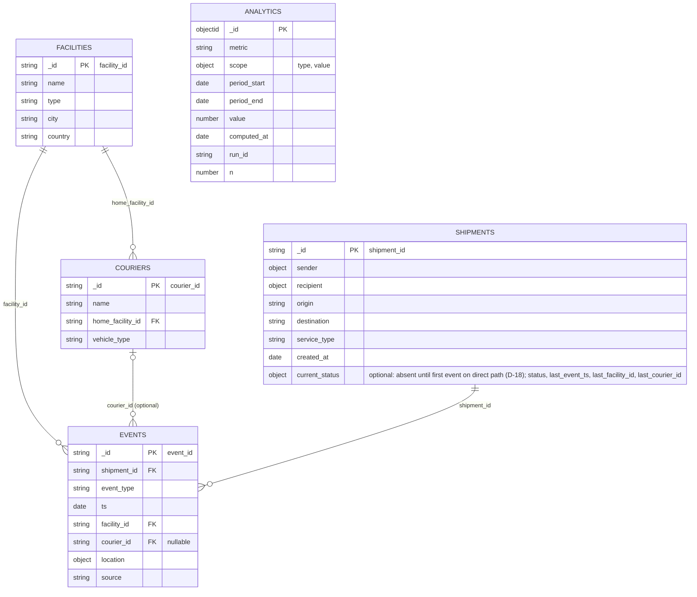

# Entity Relationship Diagram

```mermaid
erDiagram
  FACILITIES ||--o{ EVENTS : "facility_id"
  FACILITIES ||--o{ COURIERS : "home_facility_id"
  COURIERS |o--o{ EVENTS : "courier_id (optional)"
  SHIPMENTS ||--o{ EVENTS : "shipment_id"
  SHIPMENTS {
    string _id PK "shipment_id"
    object sender
    object recipient
    string origin
    string destination
    string service_type
    date created_at
    object current_status "optional: absent until first event on direct path (D-18); status, last_event_ts, last_facility_id, last_courier_id"
  }
  EVENTS {
    string _id PK "event_id"
    string shipment_id FK
    string event_type
    date ts
    string facility_id FK
    string courier_id FK "nullable"
    object location
    string source
  }
  FACILITIES {
    string _id PK "facility_id"
    string name
    string type
    string city
    string country
  }
  COURIERS {
    string _id PK "courier_id"
    string name
    string home_facility_id FK
    string vehicle_type
  }
  ANALYTICS {
    objectid _id PK
    string metric
    object scope "type, value"
    date period_start
    date period_end
    number value
    date computed_at
    string run_id
    number n
  }
```

